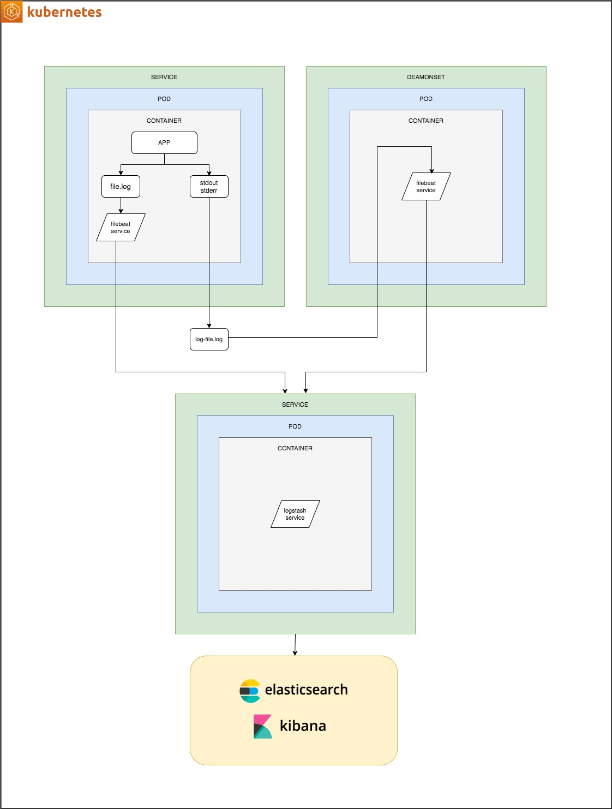

# elk-k8s-demo
a sample set of K8s artifacts to deploy an ELK stack 

# Task
Kubernetes cluster and applications logs have to be stored in centralized location

ElasticSearch was selected as such centralized location, Kibana can be used for data visualisation

# Solution
Filebeat was selected for logs shipping because of it’s lightweight, speed and integration with ELK

Filebeat will be used for shipping logs from Kubernetes cluster and from local log files in docker containers (if any)

More information about Filebeat: https://www.elastic.co/products/beats/filebeat

# Solution Architect

 